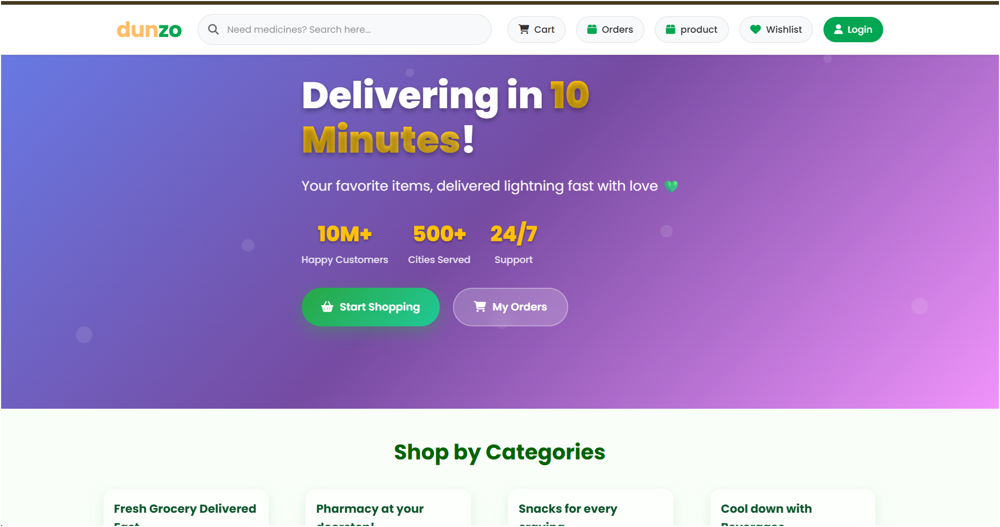

# DunzoQuick - E-Commerce Delivery System

DunzoQuick is a complete web application designed for a delivery or e-commerce business. It features a customer-facing storefront for placing orders and a powerful admin panel for managing the business operations.

## Features

### 🖥️ Admin Side
The control panel for administrators to manage the platform.

- **Dashboard Statistics**:
  - Real-time overview of **Total Revenue**, **Monthly Revenue**, and **Daily Revenue**.
  - Counters for **New Orders**, **Total Users**, and **Total Products**.
- **Order Management**:
  - View recent orders with details (Customer Name, Amount, Date).
  - Update order statuses (Pending, Delivered, Cancelled) with color-coded badges.
  - Generate and print PDF invoices.
- **Customer Insights**:
  - View registered users.
  - "Top Customers" panel highlighting high-value clients.
- **Inventory Control**: Manage products and stock levels.

### 🛒 User Side
The frontend interface for customers to browse and purchase items.

- **Account Management**: Secure Registration and Login.
- **Shopping Experience**:
  - Browse products by category.
  - Add items to the shopping cart.
- **Checkout & Payments**:
  - Secure online payments integrated via **Razorpay**.
  - Order summary review before purchase.
- **Order Tracking**: View order history and current delivery status.

### 🛠 Technical Highlights
- **Backend**: PHP with MySQLi for database interactions.
- **Frontend**: HTML5, CSS3 (Responsive Grid/Flexbox), JavaScript.
- **Styling**: Custom CSS with variables for easy theming, using 'Poppins' font and FontAwesome icons.
- **PDF Generation**: Uses `dompdf` and `FPDF` for generating reports and invoices.
- **Payments**: Integrated `razorpay/razorpay` library for handling transactions.

## Screenshots

